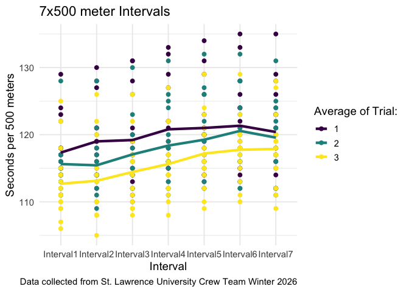

# SLU Women’s Rowing Winter Training Analysis 2026


## Data

The data was collected from the St. Lawrence University Women’s Rowing
Team during their 2026 winter training period.

The women’s rowing team ergs five times a week and records data on each
piece that they complete including interval pieces and longer steady
state pieces that build fitness and test pieces that show where their
performance is at. This data includes 7x500m intervals, 5x1000m
intervals, 2k test pieces, and 10k test pieces.

| Variable | Description |
|----|----|
| `ID` | Number indicating athlete |
| `Average` | Average time per 500m for each interval. |
| `IntervalX` | Average time for 500m for that interval. |
| `Rate` | Average strokes per minute during the piece (not included in 1000s). |
| `ClassYear` | What year the athlete is (Freshman, Sophomore, Junior, Senior) |
| `Interval` | Which interval (of 7 or 5) the time is for. |
| `Time` | Time (in seconds) for that interval. |
| `Trial` | Number indicating which number trial the piece is (first of the season, second, third). |
| `Mean` | Average time of all athletes per 500m for that interval and trial. |

## Questions of Interest

- How do athletes fare during many short interval pieces compared to
  fewer, longer intervals?

  - is there a similar trend between 7x500 and 5x1000?

  - what could be the explanation for these trends?

- What variables best predict 2k time?

  - and what does that prediction look like?

## Visualization Examples

#### 7x500m Intervals

The team completed a 7x500m interval piece three times throughout their
winter training period. This means that athletes erg 500 meters as fast
as they can and then rest for approximately 2 minutes before erging
another 500 meters. This is repeated for 7 intervals.

``` r
ggplot(data = x500_long, aes(x = Interval, y = Time)) +
  geom_point(aes(group = Trial, colour = factor(Trial))) +
  geom_line(data = x500_line, aes(x = Interval, y = Mean, 
                                   group = Trial, colour = factor(Trial)), linewidth = 1.5) +
  scale_colour_manual(values = c("purple", "steelblue", "darkorange"), name = "Average of Trial:") +
  labs(y = "Seconds per 500 meters", colour = "AverageTrial", title = "7x500 meter Intervals",
       caption = "Data collected from St. Lawrence University Crew Team Winter 2026")+
  theme_minimal(base_size = 14)
```



The points show each individual data point for each interval, coloured
by which trial it was completed during. The lines indicate the average
of the team for each interval during each trial. They show that, in
general, the team got faster each trial. A positive slope indicates a
slowing down in pace as the y-axis measures total time taken to complete
the interval.

#### Linear Regression Visualization

``` r
ggplot(data = pred_10k_2k, aes(x = second10k, y = k2)) +
  geom_point(aes(colour = factor(v1)), alpha = 0.8) +
  geom_line(data = pred_time, aes(x = second10k, y = predicted, 
                                  group = interaction(v1), 
                                  colour = factor(v1)), linewidth = 1) +
  geom_ribbon(data = pred_time, aes(x = second10k, y = predicted,
      ymin = conf.low, ymax = conf.high, group = interaction(v1),
      fill = factor(v1)), alpha = 0.2) +
  labs(colour = "Varsity Boat", fill = "Varsity Boat", y = "2k time (in seconds)",
       caption = "Data collected from St. Lawrence University Crew Team Winter 2026",
       x = "10k time (in seconds)", title = "Predicting 2k time based on 10k time and Varsity Boat Status") +
  scale_colour_manual(values = c("steelblue", "darkorange")) +
  scale_fill_manual(values = c("steelblue", "darkorange")) +
  theme_minimal(base_size = 14)
```


After an analysis of multiple models, varsity boat status and 10k time
were found to be the best predictors for 2k times of an athlete. There
is a positive correlation between 10k time and predicted 2k time.
Predicted 2k time increases, on average, by 0.15 seconds for each
additional second increase in 10k time, as long as varsity boat status
is held constant. Athletes in the varsity boat are, on average, going to
be about 10 seconds faster in their 2k than those that are not.
